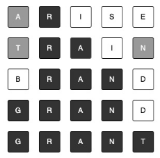

# Reference
[Test-Driven Development with Java](https://learning.oreilly.com/library/view/test-driven-development-with/9781803236230/) by Alan Mellor

# Introduction
When implementing TDD, you will most likely,g implicitly, apply YAGNI and KISS principles along the way.  
YAGNI = You Ain't Gonna Need It
KISS = Keep It Simple, Stupid

## User Story
As a ...
I want ...
So that ...

In this sample project:  


### Workflow of an Agile TDD Project
1) Pick the most impactful user story
2) Think a bit about the design to aim for
3) Use TDD to write the application logic in the core
4) Use TDD to write code to connect the core to DB
5) Use TDD to write code to connect the core to API endpoint

TDD: grow the application code **outwards**.

## Good Points
- We can have 100% code coverage and still have missing tests.
- Creating an executable specification is an important benefit of TDD.
- Triangulation ==> when we rely on adding tests to drive out the missing implementation details.
- We must be able to skim-read a test and quickly see why it exists and what it does.
- Badly written code is hard to read. Sadly, it is easy to write.
- Dependency inversion, dependency injection, Inversion of Control (IoC) ==> runtime technique where we supply an implementation of an abstraction to code that depends on it.
- Stub = a test double (for an external system) that provides an input value to create predictability in our test.
- Mock = a test double (for an external system) that records interaction with SUT = "Did the SUT call the method correctly?" 

### SOLID Principle
SRP = Single Responsibility Principle - simple building blocks
DIP = Dependency Inversion Principle - hiding irrelevant details
LSP = Liskov Substitution Principle - swappable objects
OCP = Open-Close Principle - extensible design
ISP = Interface Segregation Principle - effective interfaces

- SRP: Do one thing and do it well. Have only one reason for a code block to change.
- DIP: Make code depend on abstractions and not on details.
- LSP: A code block can be safely swapped for another if it can handle the full range of inputs and provide (at least) all expected outputs, with no undesired side effects.
- OCP: Code should be **open to extension** but **closed to modification**.
- ISP: Keep interfaces small and strongly related to a single idea.

### FIRST - Guides for Good Tests
#### F - Fast
Rule of thumb: < 2s
#### I - Isolated
No test is dependent on any other test(s). 
#### R - Repeatable
Tests must produce same result each time.
#### S - Self-verified
No programmer involvement in checking the result.
#### T - Thorough and Timely
Tests must include edge cases and done **BEFORE** writing any code for any feature/fix.

# Libraries
- org.apache.commons:commons-lang3:3.17.0 ==> provides helper class to help with equals() and hashCode() for value objects.  
  ```
  @Override
  public boolean equals(Object other) {
      return EqualsBuilder.reflectionEquals(this, other);
  }
  @Override
  public int hashCode() {
      return HashCodeBuilder.reflectionHashCode(this);
  }
  ```
# Happy Path, Negative Path, Boundary Conditions, and Code Coverage
Happy Path ==> confirmation of what should happen when all are in order
Negative Path ==> when one particular thing is not correct. This includes boundary conditions.

## Boundary Conditions to be Tested
Make sure that our tests cover boundary conditions:
- missing values: "", 0, 0.0, null
- unreasonable values: outside range
- bogus or inconsistent input values
- transitions between different states or branches of the logic
- invalid argument passed: invalid request, object, etc
- (extreme) input & output values: minimum, maximum, exact values of input and output range
- badly formatted data
- numeric overflow  
> 100% code coverage should include all possible boundary condition tests. NOTE: 100% code coverage != complete test.  
> Your QA engineer should be able to help you identify boundary conditions.

# Wordz
- Word to guess: 5 letter
- A player has 6 attempts to guess the word
- At each guess:
  - Correct letter - correct position ==> black background
  - Correct letter - incorrect position ==> gray background
  - Incorrect letter ==> white background  
  
- Points:
  - 6: guessed at 1st attempt, 
  - 5: guessed at 2nd attempt, and so on
  - 1: guessed at final attempt (6th)
- 